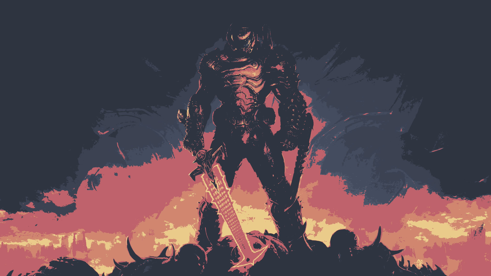
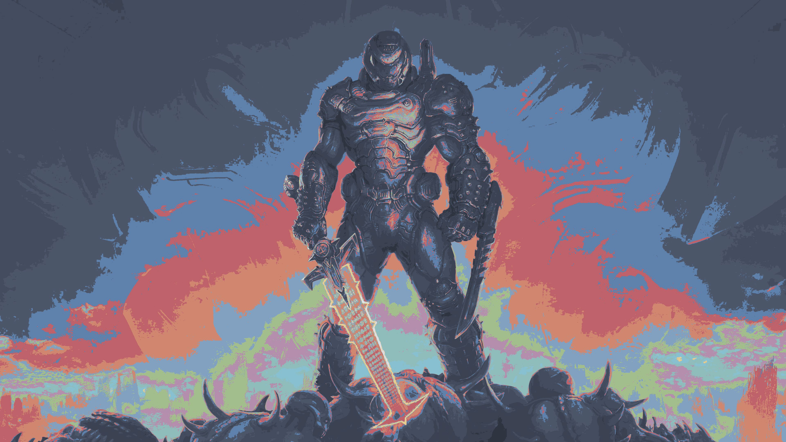
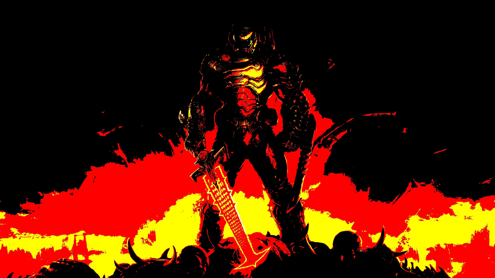
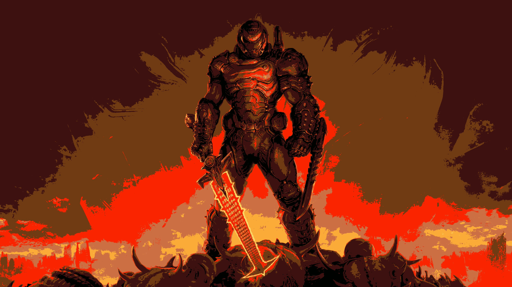
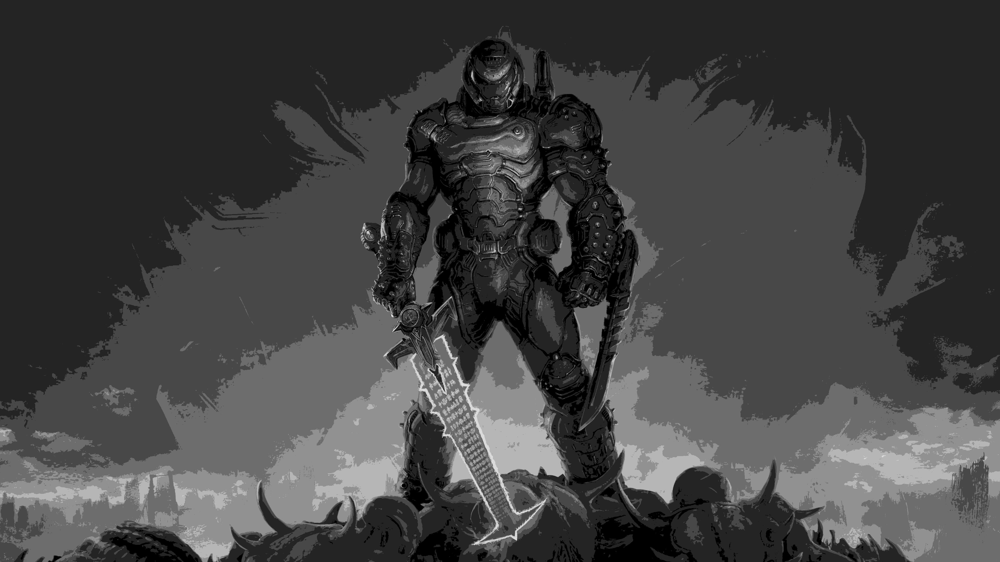

# KQuantizer

KQuantizer is a very simple CLI color quantizer for images. It takes a path and a mode as required arguments and returns an image quantized with the desired mode. It works best with high contrast images that have a big focal object.

Currently it has 5 modes:
- search
- equistant
- self
- self-sort
- bw

## Search

Searches for the nearest color from the selected palette to each pixel of the image.

<p float="left">
    
    
</p>

## Equidistant

Quantizes each pixel to a band based on it's brightness and then assigns a color from the palette to each band.

<p float="left">
    
    
</p>

## Self

Quantizes each channel to a band given the selected resolution, for example a resolution of 2 ```-r 2``` will give a total of 8 bands since RGB is 3 channels.

<p float="left">
    
    
</p>

## Self-Sort

Similar to _equidistant_ but creates a pallette based on the brightness of the pixels in the input file.

<p float="left">
    
    
</p>

## BW

Quantizes each pixel to a band in greyscale based on brightness given the selected resolution.

<p float="left">
    
    
</p>

## Options and Flags

Not every mode supports all flags or options, here is the possible options that you can pass for each one:
- **All**
    - Detect edges and blur everything except edges before processing ```-b```, pass a radius for the blur.
    - Select the file output ```-o```, if not passed will append mode and palette to the name of the file.
    - If the output file is in ```.jpg``` format you can pass ```-q``` as a number between ```1``` and ```100``` to select the export quality, if not passed it will default to ```80```. 
- **Search**
    - Select palette ```-p```, the default is ```nord```.
- **Equidistant**
    - Select palette ```-p```, the default is ```nord```.
- **Self**
    - Select resolution with ```-r```.
- **Self-Sort**
    - Select resolution with ```-r```.
- **BW**
    - Select resolution with ```-r```.
    
You can always see what options are available by passing ```-h```.

## Palettes

Currently has only 3 palettes but you can add your own since it sources them from the ```palettes.txt``` file.

The syntax is quite simple, you denote a new palette with ```[]``` and then you just list your RGB values between 0 and 255. Here is an example:
~~~
[my_palette]
67 76 94
76 86 106
216 222	233
229	233	240
~~~

It will automatically detect the end of the palette and it also supports comments as lines starting with ```#```.

## Installation

Currently there is no way to install it in your system, however you can compile it and run it from it's directory.

Dependencies to compile:
- git
- cmake
- g++ (or your compiler of preference)

To download and compile:
~~~shell
git clone https://github.com/kanvolu/kquantizer.git
cd kquantizer/build
cmake -DCMAKE_BUILD_TYPE=Release ..
cmake --build .
~~~

And to execute it you have to ```cd``` to the directory that contains the executable, if you compiled the code yourself it will be ```kquantizer/build```, and run
~~~
./KQuantizer <input> <mode> [OPTIONS]
~~~